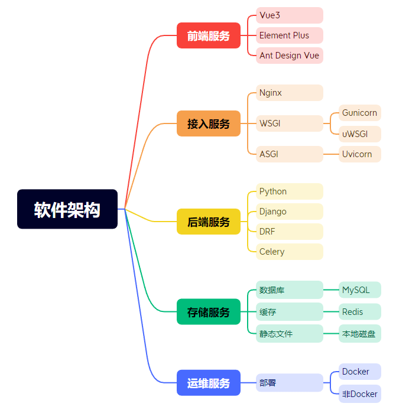
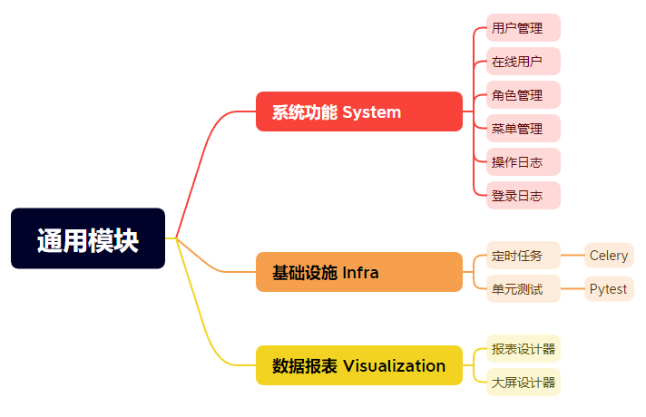

# MarsMgn 火星信息管理平台

**愿景：向 [ruoyi](https://gitee.com/zhijiantianya/ruoyi-vue-pro) 学习，打造中国第一流的快速开发平台**

**使命：提升开发人员能力，助力企业信息化，以开源改变世界**

**价值观：不重复造轮子，开放共享合作**

**严肃声明：现在、未来都不会有商业版本，所有代码全部开源!！**

如果这个项目让你有所收获，记得 Star 关注哦，这对我是非常不错的鼓励与支持。

## 介绍
基于 Django + DRF + Vue 实现的后台管理平台。以开发者为中心，打造中国第一流的快速开发平台，全部开源，个人与企业可 100% 免费使用。

> 有任何问题，或者想要的功能，可以在 _Issues_ 中提交。
>
> 😜 给项目点点 Star 吧，这对我们真的很重要！

软件架构

## 开源协议

**为什么推荐使用本项目？**

① 本项目采用比 Apache 2.0 更宽松的 [MIT License](https://gitee.com/zhijiantianya/ruoyi-vue-pro/blob/master/LICENSE) 开源协议，个人与企业可 100% 免费使用，不用保留类作者、Copyright 信息。

② 代码全部开源，不会像其他项目一样，只开源部分代码，让你无法了解整个项目的架构设计。

TODO 开源项目对比

③ 代码整洁、架构整洁，遵循《阿里巴巴 Java 开发手册》规范，代码注释详细。

详细的文档，以及相关学习资料。

## 内置功能

## 技术栈

框架

| 框架                                                         | 说明                  | 版本           | 学习指南                                                     |
| ------------------------------------------------------------ | --------------------- | -------------- | ------------------------------------------------------------ |
| [Spring Boot](https://spring.io/projects/spring-boot)        | 应用开发框架          | 2.7.18         | [文档](https://github.com/YunaiV/SpringBoot-Labs)            |
| [MySQL](https://www.mysql.com/cn/)                           | 数据库服务器          | 5.7 / 8.0+     |                                                              |
| [Druid](https://github.com/alibaba/druid)                    | JDBC 连接池、监控组件 | 1.2.23         | [文档](http://www.iocoder.cn/Spring-Boot/datasource-pool/?yudao) |
| [MyBatis Plus](https://mp.baomidou.com/)                     | MyBatis 增强工具包    | 3.5.7          | [文档](http://www.iocoder.cn/Spring-Boot/MyBatis/?yudao)     |
| [Dynamic Datasource](https://dynamic-datasource.com/)        | 动态数据源            | 3.6.1          | [文档](http://www.iocoder.cn/Spring-Boot/datasource-pool/?yudao) |
| [Redis](https://redis.io/)                                   | key-value 数据库      | 5.0 / 6.0 /7.0 |                                                              |
| [Redisson](https://github.com/redisson/redisson)             | Redis 客户端          | 3.32.0         | [文档](http://www.iocoder.cn/Spring-Boot/Redis/?yudao)       |
| [Spring MVC](https://github.com/spring-projects/spring-framework/tree/master/spring-webmvc) | MVC 框架              | 5.3.24         | [文档](http://www.iocoder.cn/SpringMVC/MVC/?yudao)           |
| [Spring Security](https://github.com/spring-projects/spring-security) | Spring 安全框架       | 5.7.11         | [文档](http://www.iocoder.cn/Spring-Boot/Spring-Security/?yudao) |
| [Hibernate Validator](https://github.com/hibernate/hibernate-validator) | 参数校验组件          | 6.2.5          | [文档](http://www.iocoder.cn/Spring-Boot/Validation/?yudao)  |
| [Flowable](https://github.com/flowable/flowable-engine)      | 工作流引擎            | 6.8.0          | [文档](https://doc.iocoder.cn/bpm/)                          |
| [Quartz](https://github.com/quartz-scheduler)                | 任务调度组件          | 2.3.2          | [文档](http://www.iocoder.cn/Spring-Boot/Job/?yudao)         |
| [Springdoc](https://springdoc.org/)                          | Swagger 文档          | 1.7.0          | [文档](http://www.iocoder.cn/Spring-Boot/Swagger/?yudao)     |
| [SkyWalking](https://skywalking.apache.org/)                 | 分布式应用追踪系统    | 8.12.0         | [文档](http://www.iocoder.cn/Spring-Boot/SkyWalking/?yudao)  |
| [Spring Boot Admin](https://github.com/codecentric/spring-boot-admin) | Spring Boot 监控平台  | 2.7.10         | [文档](http://www.iocoder.cn/Spring-Boot/Admin/?yudao)       |
| [Jackson](https://github.com/FasterXML/jackson)              | JSON 工具库           | 2.13.5         |                                                              |
| [MapStruct](https://mapstruct.org/)                          | Java Bean 转换        | 1.6.3          | [文档](http://www.iocoder.cn/Spring-Boot/MapStruct/?yudao)   |
| [Lombok](https://projectlombok.org/)                         | 消除冗长的 Java 代码  | 1.18.34        | [文档](http://www.iocoder.cn/Spring-Boot/Lombok/?yudao)      |
| [JUnit](https://junit.org/junit5/)                           | Java 单元测试框架     | 5.8.2          | -                                                            |
| [Mockito](https://github.com/mockito/mockito)                | Java Mock 框架        | 4.8.0          | -                                                            |

## 演示图

## 安装教程

1.  xxxx
2.  xxxx
3.  xxxx

## 使用说明

1.  xxxx
2.  xxxx
3.  xxxx

## 参与贡献

1.  Fork 本仓库
2.  新建 Feat_xxx 分支
3.  提交代码
4.  新建 Pull Request

## 特技

1.  使用 Readme\_XXX.md 来支持不同的语言，例如 Readme\_en.md, Readme\_zh.md
2.  Gitee 官方博客 [blog.gitee.com](https://blog.gitee.com)
3.  你可以 [https://gitee.com/explore](https://gitee.com/explore) 这个地址来了解 Gitee 上的优秀开源项目
4.  [GVP](https://gitee.com/gvp) 全称是 Gitee 最有价值开源项目，是综合评定出的优秀开源项目
5.  Gitee 官方提供的使用手册 [https://gitee.com/help](https://gitee.com/help)
6.  Gitee 封面人物是一档用来展示 Gitee 会员风采的栏目 [https://gitee.com/gitee-stars/](https://gitee.com/gitee-stars/)
